# buildkit-state

Dramatically speeds up the build of Dockerfiles that require compiling or building dependencies.  
Inspired by [dashevo/gh-action-cache-buildkit-state](https://github.com/dashevo/gh-action-cache-buildkit-state).

- Support Github actions cache or S3 as remote cache storage
- Simple setup
- Works well with [`docker/setup-buildx-action`](https://github.com/docker/setup-buildx-action)
  and [`docker/build-push-action`](https://github.com/docker/build-push-action)
- Customizable - Compression level & cache type && caching policy

## Goal

The [BuildKit cache (e.g. `--mount=type=cache,target=/some/path`)](https://docs.docker.com/engine/reference/builder/#run---mounttypecache)
is different from the layer cache
and [it can make image build very fast](https://vsupalov.com/buildkit-cache-mount-dockerfile/).
But unlike layer cache, [`docker/build-push-action`](https://github.com/docker/build-push-action)'
s `cache-to`&`cache-from` does not includes buildkit cache.  
This action can restore/save BuildKit state on workflow to speed up CI/CD.

## Benchmark

See [example projects](example) for reproducible code.

```mermaid
gantt
    title Docker Build time
    dateFormat  X
    axisFormat %s

    section First build
        Vanilla (6m37s): active, 0, 337
        With BuildKit Caching (6m41s): 0, 341
    section Second build
        Vanilla (6m37s): active, 0, 337
        With BuildKit Caching (10s): 0, 10
    section Add a dep
        Vanilla (6m39s): active, 0, 339
        With BuildKit Caching (10s): 0, 10
```



## Usage

See [example projects](example) and [example workflow](.github/workflows/benchmark.yaml) for more detailed usages.

### Example Dockerfile

```dockerfile
FROM python:3.11

RUN --mount=type=cache,target=/root/.cache/pip \
    pip install pandas uvicorn[standard] fastapi
```

### Caching every commit

```yaml
on:
  pull_request:
  workflow_dispatch:

jobs:
  build:
    runs-on: ubuntu-latest
    steps:
      - name: Set up Docker Buildx
        id: buildx
        uses: docker/setup-buildx-action@v2

      - name: Restore BuildKit state
        uses: isac322/buildkit-state@v2
        with:
          buildx-name: ${{ steps.buildx.outputs.name }}

      - name: Build
        uses: docker/build-push-action@v4
        with:
          push: false
```

## Inputs

| Name                 | Type            | Required | Default value                                       | Description                                                                                                |
|----------------------|-----------------|:--------:|-----------------------------------------------------|------------------------------------------------------------------------------------------------------------|
| `buildx-name`        | String          |    ⭕     |                                                     | Name of buildx. Fill name output `of docker/setup-buildx-action` actions.                                  |
| `cache-key`          | String          |    ⭕     | `${{ runner.os }}-buildkit_state-${{ github.sha }}` | Unique id of cache. When loading, it is used for retrieval, and when saving, it is allocated to the cache. |
| `cache-restore-keys` | List of string  |    ⭕     | `${{ runner.os }}-buildkit_state-`                  | Keys to be used if the search with `cache-key` fails on load.                                              |
| `target-types`       | List of enum ¹  |    ⭕     | `exec.cachemount` and `frontend`                    | Choose which type of BuildKit state to save. You can use the default value in most cases.                  |
| `rewrite-cache`      | Boolean         |          | `false`                                             | Whether to overwrite when the same cache key already exists.                                               |
| `save-on-failure`    | Boolean         |          | `false`                                             | Whether to save cache even if job fails.                                                                   |
| `resume-builder`     | Boolean         |          | `true`                                              | Resume buildx builder after successfully load cache and print disk usage.                                  |
| `compression-level`  | Integer (1~22)  |          | `3`                                                 | Zstd compression level (from 1 to 22)                                                                      |
| `window-size`        | Integer (10~31) |          | `27`                                                | Zstd window size (from 10 to 31)                                                                           |

> Note
> - ¹ Currently `regular`, `source.local`, `exec.cachemount`, `frontend`, `internal` are
    supported ([Source](https://pkg.go.dev/github.com/moby/buildkit/client#UsageRecordType))

## Output

| Name                 | Type   | Description             |
|----------------------|--------|-------------------------|
| `restored-cache-key` | String | Cache key restored from |

## Requirements

In most case, you **do not need to consider** these requirements.  
Github hosted runner fulfill all these requirements,
but self hosted BuildKit daemon may not work.

- Only supports [BuildKit docker-container driver](https://docs.docker.com/build/drivers/) (which is default driver
  of `docker/setup-buildx-action`)