# Example python project

An example project to see how the BuildKit cache affects the build time in a project that has dependencies that need to be compiled like any other Python project and is built with Docker.

You can check example Github Actions workflow on [`.github/workflows/benchmark.yaml`](/.github/workflows/benchmark.yaml)

## Build time benchmark

#### Environment

CPU: AMD Ryzen 7 5800X 8-Core Processor (16 Threads)  
Memory: 32GiB  
OS: Linux 6.4.3  
Docker Engine: 24.0.2  
BuildKit: v0.11.7-0.20230525183624-798ad6b0ce9f  

```mermaid
gantt
    title Docker Build time
    dateFormat  X
    axisFormat %s

    section First build
    Vanilla (6m37s)               : active, 0, 337
    With BuildKit Caching (6m41s) :         0, 341
    section Second build
    Vanilla (6m37s)             : active, 0, 337
    With BuildKit Caching (10s) :         0, 10
    section Add a dep
    Vanilla (6m39s)             : active, 0, 339
    With BuildKit Caching (10s) :         0, 10
```

By definition of Cache, of course, you can't speed up the first build.
Instead, once cached, even if dependencies are added from then on, you can save a lot of time.

You can reproduce on local via `./benchmark.bash`.